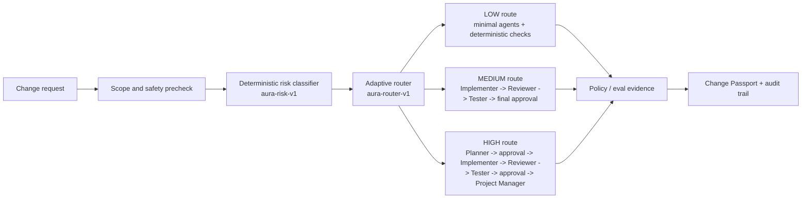
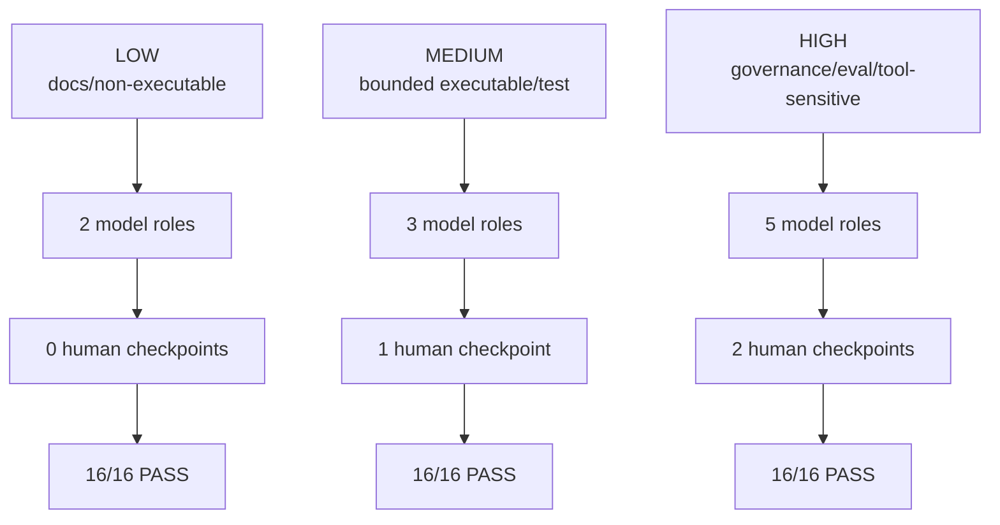
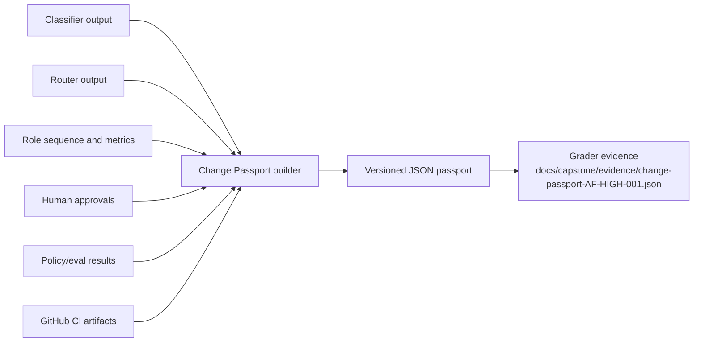
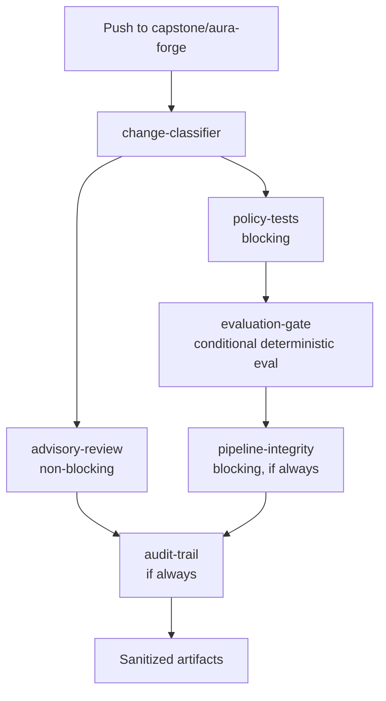

# Final Architecture

## System Architecture

## LOW / MEDIUM / HIGH Route Comparison

## Evidence Flow / Change Passport

## CI Governance Flow

## What Is Not In The Architecture

- No Render deployment.
- No Vercel deployment.
- No production database write.
- No FitGPT production mutation.
- No real user data.
