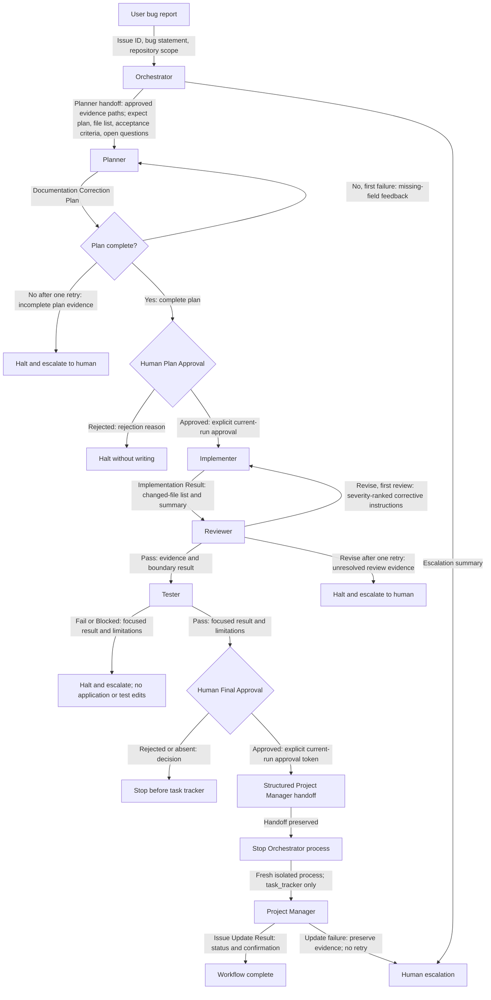

# Backend Onboarding Documentation Orchestration

Controlled issue: `COURSE-FITGPT-001`

## Workflow diagram

## Plain-text fallback

1. The user sends the bug report and controlled issue `COURSE-FITGPT-001` to the Orchestrator.
2. The Orchestrator gives the Planner only the issue, repository path, and approved evidence-file list. The Planner returns a complete documentation-only plan.
3. An incomplete Planner output is returned once with missing-field feedback. A second incomplete output halts the workflow.
4. A human must explicitly approve the plan before the Implementer receives it. Rejection halts without any write.
5. The Implementer receives the approved plan and exact writable allowlist, then returns only a changed-file list and implementation summary.
6. The Reviewer compares the changes with the allowed evidence. A first `Revise` result returns exact corrective instructions to the Implementer once. A second `Revise` halts and escalates.
7. After Reviewer `Pass`, the Tester receives only the changed-file list and `backend/tests/test_config_startup.py`. `Fail` or `Blocked` halts and escalates without application-code or test edits.
8. After Reviewer and Tester pass, a human must explicitly approve the issue update. Rejection or missing approval stops before a Project Manager handoff is created.
9. The Orchestrator returns a structured handoff containing only the controlled issue, gate results, final summary, and current-run approval evidence, then stops without invoking `task_tracker` or Project Manager.
10. Project Manager starts in a fresh role-isolated process with only `task_tracker`, returns an issue status and confirmation, and is not retried automatically on failure.

## Role summaries

### Planner

Produces a documentation-only correction plan, exact file list, acceptance criteria, and open questions. It is read-only and does not implement, test, review, or update the issue.

### Implementer

Applies only the human-approved edits to `README.md` and `backend/.env.example`. It does not run tests, update the issue, modify code or tests, or expand the approved scope.

### Reviewer

Independently compares proposed edits with committed configuration and focused-test evidence. It returns `Pass` or `Revise` with severity-ranked findings and does not write files.

### Tester

Runs only the bounded dummy test representation for `backend/tests/test_config_startup.py`, reports `Pass`, `Fail`, or `Blocked`, and does not repair failures or modify files.

### Project Manager

Runs in a fresh direct process and updates only dummy issue `COURSE-FITGPT-001`,
and only after explicit final human approval. Its process has only `task_tracker`;
it cannot read or write repository files or run tests.

### Orchestrator

Coordinates handoffs through Tester, evaluates output contracts, enforces the
one-retry limits, halts unsafe paths, requests both human approvals, and produces
the final Project Manager handoff. Its process explicitly denies `task_tracker`
and stops before the isolated Project Manager process begins.

## Current setup status

Run 1 reached its intended Planner checkpoint. Failed Run 2 remains preserved:
the Orchestrator attempted `task_tracker` before approval and the course server
denied the request. Run 3 is the authorized role-isolated replacement and must
verify the process boundary before workflow execution; no Run 3 result is claimed
until its evidence is recorded.
